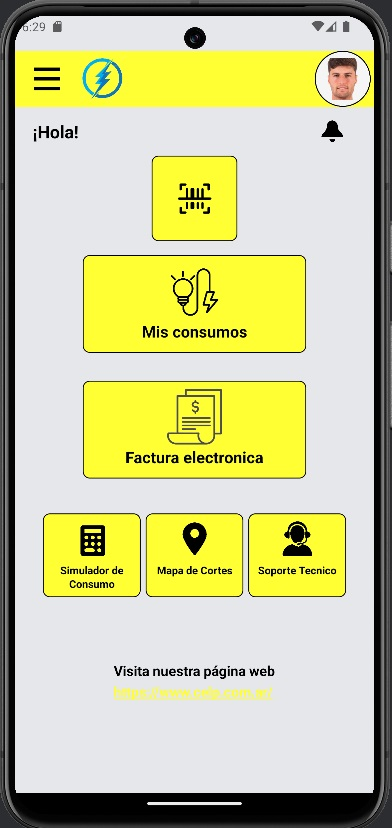
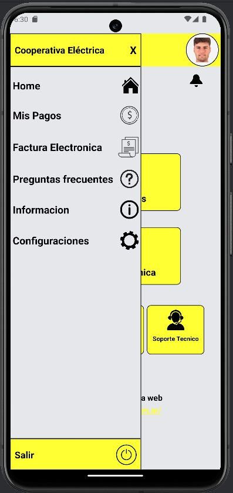
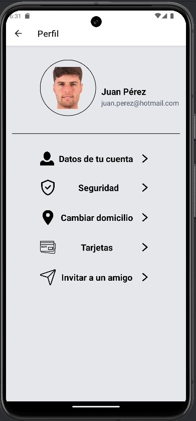
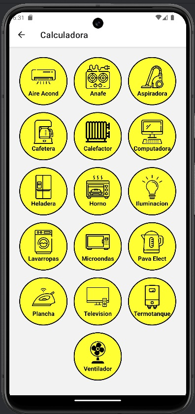

Electric Company Platform App - React Native
This project is a frontend application developed using React Native, Expo, and Tailwind CSS, simulating a platform for an electric company. The app enables users to manage various aspects of their energy consumption and account details conveniently on their mobile devices.

Features:
User Authentication:

Register and log in securely to access personalized features.
Billing Management:

View current and past bills, and conveniently pay them within the app.
Energy Consumption Monitoring:

Track and visualize energy usage over time to manage consumption effectively.
Appliance Cost Calculator:

Estimate energy costs based on usage patterns of household appliances.
Profile Management:

Edit user profile details such as contact information and preferences.
Technologies Used:
React Native: A JavaScript framework for building native mobile applications.
Expo: Simplifies the process of building and deploying React Native applications.
Tailwind CSS: Utility-first CSS framework for styling components efficiently.
Project Setup:
Installation:

Ensure Node.js and npm are installed.
Clone the repository and navigate to the project directory.
Run npm install to install dependencies.
Running the App:

Execute npx expo start to launch the Expo development server.
Scan the QR code with the Expo Go app on your mobile device or run in an emulator.
Contributing:
Contributions and feedback are welcome! Feel free to fork the repository, create a new branch, and submit a pull request with your improvements.

License:
This project is licensed under the MIT License, allowing for both personal and commercial use with proper attribution.

Acknowledgments:
Acknowledge any libraries, tools, or resources used that significantly contributed to the project.
Contact:
For questions or suggestions regarding this project, contact Your Name.
